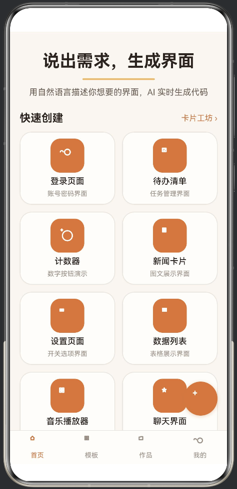
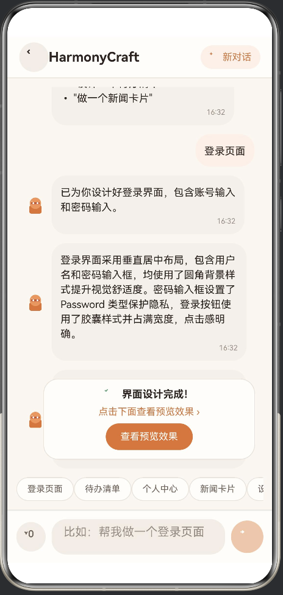
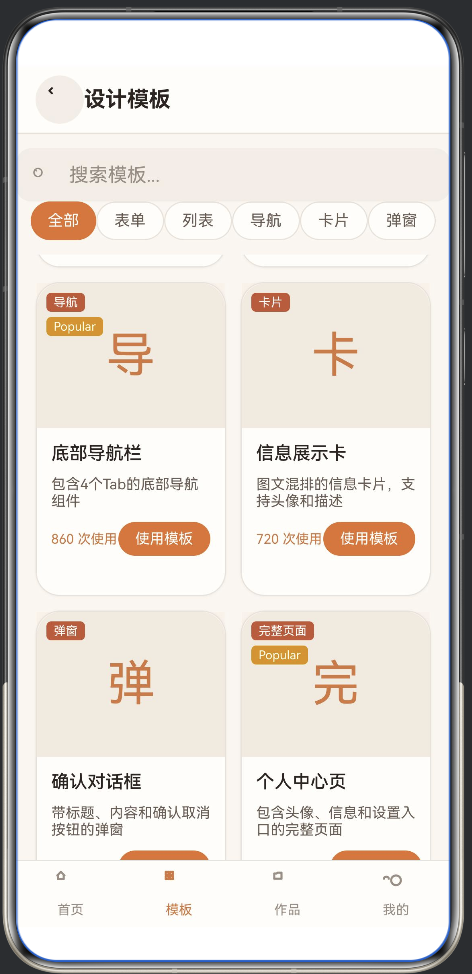
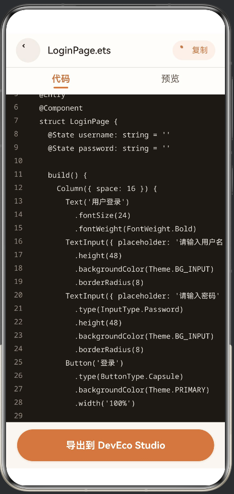
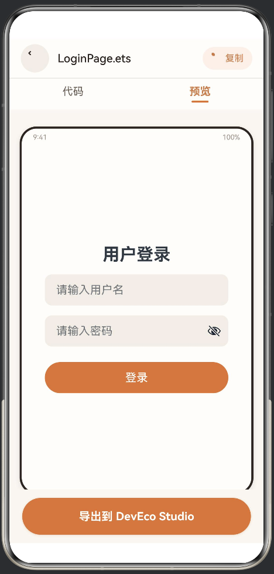
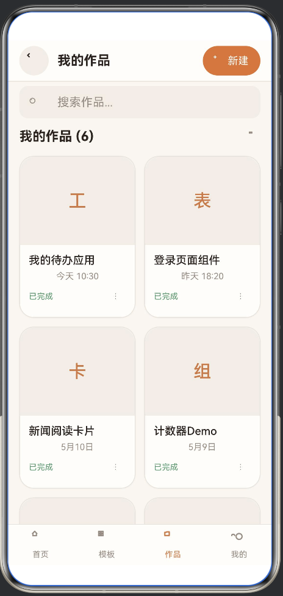

# HarmonyCraft

> HarmonyOS AI对话式代码模板生成工具 | ArkTS + ArkUI

一款基于 HarmonyOS 的 AI 界面设计助手，用户通过自然语言描述需求，即可实时生成 ArkTS 代码和界面预览，帮助开发者快速搭建鸿蒙应用原型。

## 功能特性

- **AI 对话生成界面**：输入自然语言（如"帮我做一个登录页面"），AI 实时生成 ArkTS 代码（当前基于本地规则引擎，接入云端 API 后将大幅增强）
- **模板市场**：15+ 预设界面模板，支持分类筛选（表单/列表/导航/卡片/弹窗/完整页面）
- **快捷创建**：首页提供 10 种常用界面一键直达
- **代码实时预览**：生成代码支持即时预览效果
- **项目管理**：项目列表、搜索、重命名、删除，自动保存历史记录
- **卡片编辑器**：可视化编辑界面卡片
- **语音输入**：支持语音快速发起设计需求
- **鸿蒙服务卡片**：支持桌面服务卡片（FormAbility），快速访问

## 技术栈

| 技术 | 说明 |
|------|------|
| ArkTS | HarmonyOS 原生开发语言 |
| ArkUI | 声明式 UI 框架 |
| Service Widget | 鸿蒙桌面服务卡片 |
| 本地规则引擎 | 关键词匹配生成对应模板代码 |

## 项目结构

```
entry/src/main/ets/
├── pages/          # 9 个页面（首页/聊天/模板市场/代码预览/项目管理/项目详情/卡片编辑/个人中心/设置）
├── components/     # 5 个公共组件（AI头像/底部导航/图标/空状态/骨架屏）
├── services/       # 2 个服务模块（FormAbility/FormCard 服务卡片）
├── models/         # 1 个数据模型
└── utils/          # 1 个主题工具类
```

## 运行方式

1. 用 DevEco Studio 打开本项目
2. 编译运行到模拟器或真机（支持 phone / tablet / 2in1）
3. 直接体验所有功能，无需额外配置

> 当前 AI 生成基于本地规则引擎（关键词匹配），内置 10 种常用界面模板。无需网络即可使用。
>
> **后续规划**：接入云端大模型 API 后，AI 对话功能和所有 AI 相关功能将被全面完善，支持更复杂的自然语言理解和自定义界面生成。

## 技术架构

| 层级 | 实现 | 延迟 | 是否需要网络 |
|------|------|------|------------|
| 本地规则引擎 | 关键词匹配 + 预设模板 | <10ms | ❌ 不需要 |
| UI 渲染 | ArkUI 声明式框架 | 1-3ms | ❌ 不需要 |
| 服务卡片 | HarmonyOS FormAbility | 1-3s | ❌ 不需要 |

## 截图

| 首页 | AI 对话生成 | 模板市场 |
|:---:|:---:|:---:|
|  |  |  |

| 代码查看 | 实时预览 | 项目管理 |
|:---:|:---:|:---:|
|  |  |  |

## 声明

- 本项目为个人学习作品，非商业应用
- 生成的代码为演示模板，实际开发中请根据需求调整
- 语音输入为模拟功能，实际效果以真机为准

## License

MIT License
